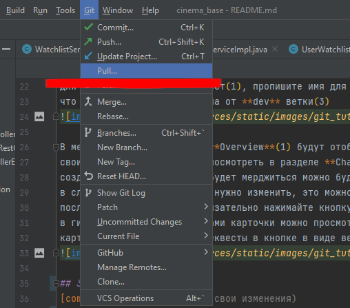
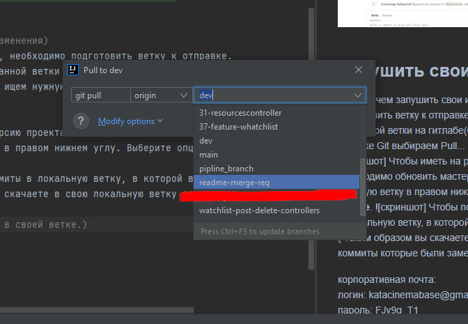

# Документация Cinema base
## 1. Запуск проекта

В пропертях проекта для подключения к БД используются параметры типа: ${POSTGRESQL_SERVER}

Их можно прописать в конфигурации проекта

1 шаг  

2 шаг  

## 2. Создание merge request

Открываем за асигненую за вами карточку  

Перед созданием мердж реквеста необходимо задать осмысленное(!) название для ветки, 
для этого открой мердж реквест(1), пропишите имя для ветки(2) и убедитесь, 
что новая ветка будет создана от **dev** ветки(3)

В мердж реквесте в разделе **Overview**(1) будут отображаться замечания к коду, 
свои изменения можно будет посмотреть в разделе **Changes**(2), 
созданная ветка и куда она будет мерджиться можно будет посмотреть в блоке (3), 
в случае если мердж реквест нужно изменить, это можно сделать в кнопке **Edit**(4), 
после выполнения задания обязательно нажимайте кнопку **Mark as ready**(5), 
в гитлабе за асигненые за вами карточки можно просмотреть по кнопке справа в виде 
карточек(6), а ваши мердж реквесты в кнопке в виде веток(7)

## 3. Пушить свои изменения
Прежде чем запушить свои изменения, необходимо подготовить ветку к отправке.
Для этого нужно сделать pull, созданной ветки на гитлабе(Create merge request).На панели 
во вкладке Git выбираем Pull... -> ищем нужную ветку

Чтобы иметь на руках актуальную версию проекта необходимо обновить мастер-ветку.
Для этого нажмите на текущую ветку в правом нижнем углу. Выберите опцию **dev | update**.

Чтобы подтянуть все смерженные коммиты в локальную ветку, в которой вы работаете, нужно:

[comment]: <> (   пока вы работали в своей ветке.)

корпоративная почта:  
логин: katacinemabase@gmail.com  
пароль: FJy9g_T1 