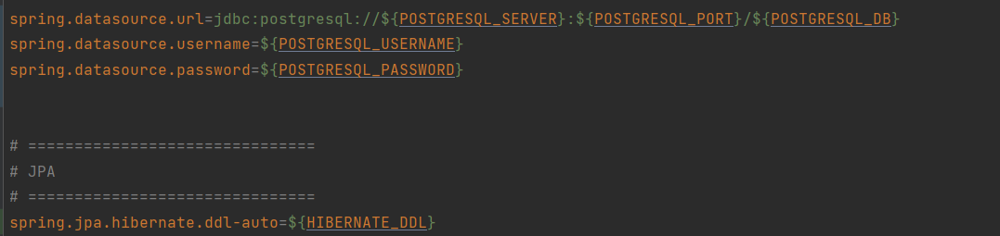
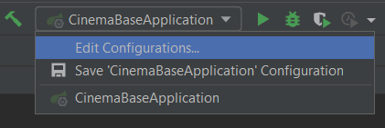
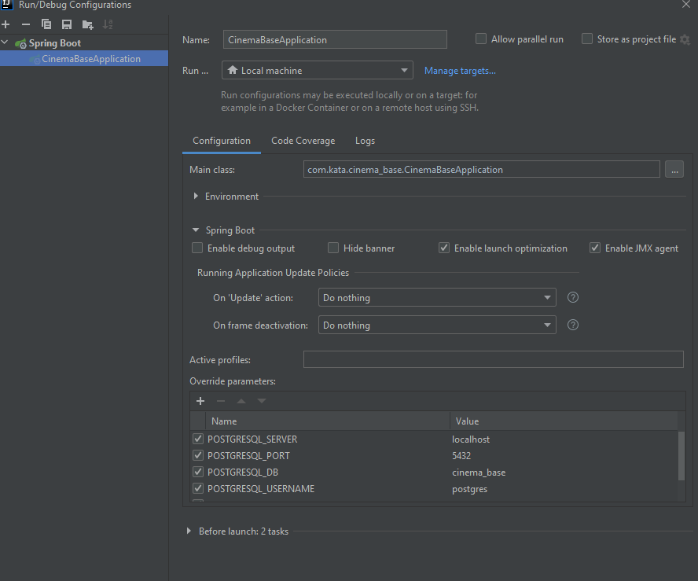
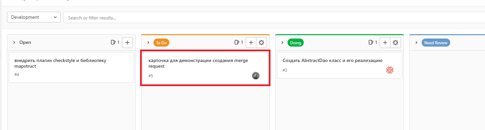
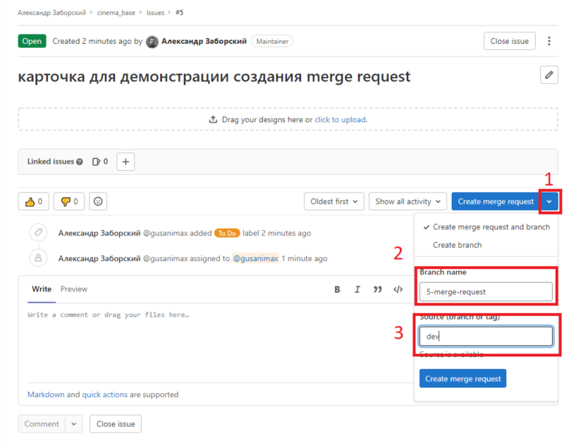
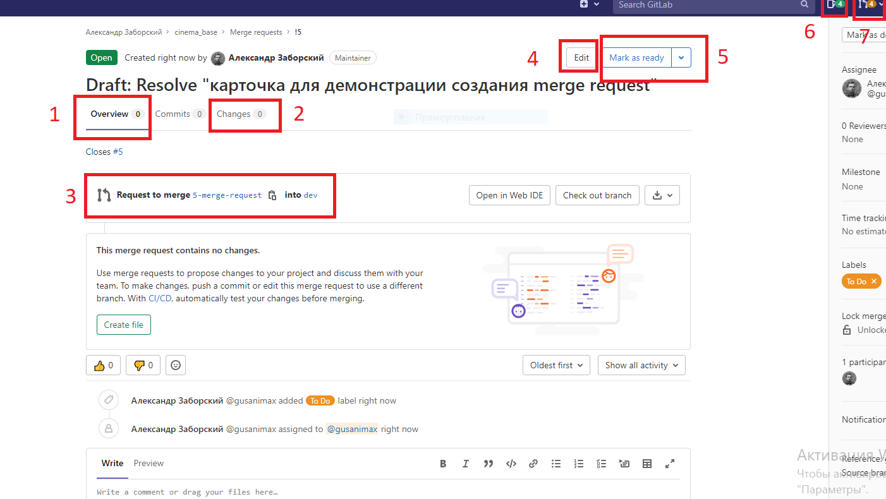
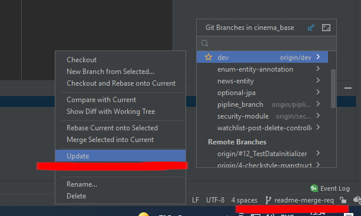
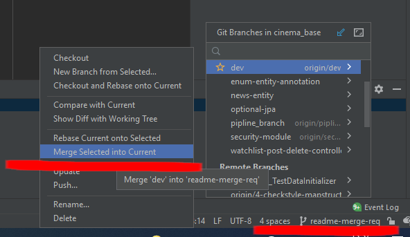

# Документация Cinema base
## 1. Запуск проекта

В пропертях проекта для подключения к БД используются параметры типа: ${POSTGRESQL_SERVER}

Их можно прописать в конфигурации проекта

1 шаг  

2 шаг  

## 2. Создание merge request

Открываем за асигненую за вами карточку  

Перед созданием мердж реквеста необходимо задать осмысленное(!) название для ветки, 
для этого открой мердж реквест(1), пропишите имя для ветки(2) и убедитесь, 
что новая ветка будет создана от **dev** ветки(3)

В мердж реквесте в разделе **Overview**(1) будут отображаться замечания к коду, 
свои изменения можно будет посмотреть в разделе **Changes**(2), 
созданная ветка и куда она будет мерджиться можно будет посмотреть в блоке (3), 
в случае если мердж реквест нужно изменить, это можно сделать в кнопке **Edit**(4), 
после выполнения задания обязательно нажимайте кнопку **Mark as ready**(5), 
в гитлабе за асигненые за вами карточки можно просмотреть по кнопке справа в виде 
карточек(6), а ваши мердж реквесты в кнопке в виде веток(7)

## 3. Пушить свои изменения
Прежде чем запушить свои изменения, необходимо подготовить ветку к отправке.

Чтобы иметь на руках актуальную версию проекта, необходимо обновить мастер-ветку, 
это нужно делать каждый раз перед отправкой задачи на проверку
Для этого нажмите на текущую ветку в правом нижнем углу. Выберите опцию **dev | update**.

Чтобы подтянуть все смерженные коммиты в локальную ветку, в которой вы работаете, нужно:

## 4. Написание тестов
* Тесты создаются согласно рест контроллерам (на каждый рест контроллер свой тестовый класс)
* Id сущностей написанных в датасетах желательно начинать с 100
* На каждый контроллер создается свой пакет с датасетами, стоит избегать изменения в уже написанных датасетах, если нужны дополнительные данные, необходимо создать подпакет и уже в нем описывать нужные данные
* При написании тестов используется аннотация @DatabaseSetup, которая указывает как должны быть заполнены таблицы БД перед запуском каждого метода тестирования.
* Для очистки таблиц БД после завершения теста используется аннотация @DatabaseTearDown, как правило, с параметром DatabaseOperation.DELETE_ALL.
* Желательно использовать @DatabaseSetup и @DatabaseTearDown над каждым методом, а не классом.
* В тестах не используется аннотация @Transactional.
* DBUnit не использует конкретную схему для поиска таблиц, а проверяет всю базу на наличие конкретных таблицы из-за чего может возникнуть AmbiguousTableNameException,
  для решения этой проблемы необходимо создать отдельного пользователя в БД, которому будет доступна только одна схема, либо запустить докер контейнер с отдельной базой данных.
* В случае возникновения ошибки constraints foreign key после завершения теста, убедитесь, что правильно указали порядок таблиц в xml файлах и в аннотациях,
  если в результате выполнения теста были заполнены таблицы не указанные в xml файлах, для их очистки, можно прописать: <\**название таблицы*\* /> или уже указать файл с таблицами, которые необходимо удалить в аннотации @DatabaseTearDown (предпочтительней 2 вариант!).
* Наименование xml файлов с тестовыми данными должно соответствовать наименованию таблицам в БД
* Для отправки dto использовать ObjectMapper

[comment]: <> (* Для запуска локальных тестов необходимо использовать аргумент -Dspring.profiles.active=it-local &#40;аргумент можно добавить в стандартную настройку профиля JUnit при необходимости скорректировать настройки в application-it-local.properties&#41;)

корпоративная почта:  
логин: katacinemabase@gmail.com  
пароль: FJy9g_T1 