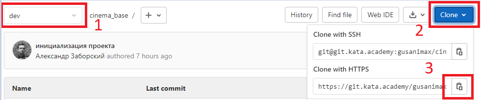
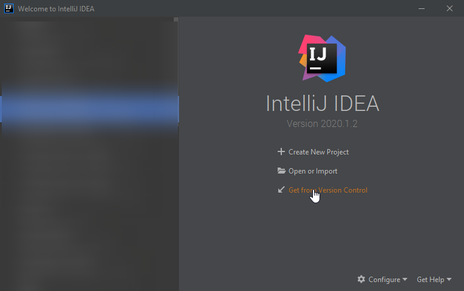
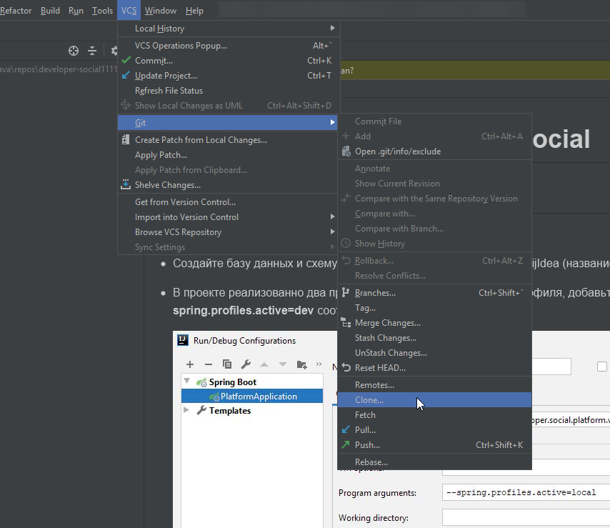
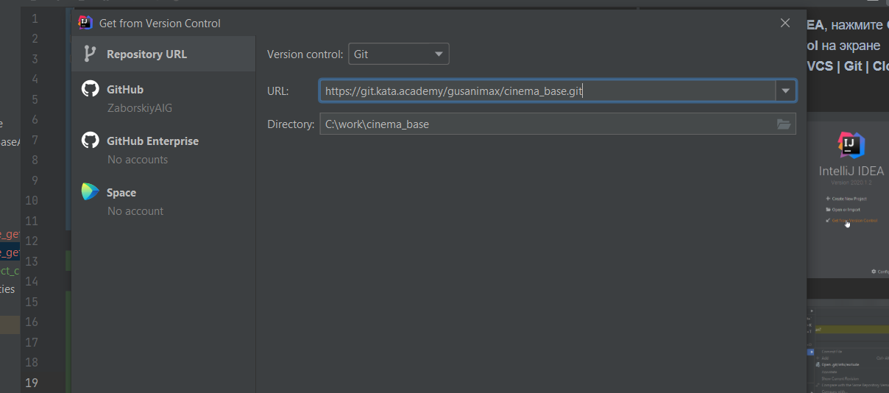

# Документация Cinema base
## Работа с git
### Клонирование проекта

1. На странице репозитория убедитесь, что выбрана ветка **dev** (1), нажмите кнопку **Clone** (2), скопируйте ссылку (3).

2. Откройте **Intellij IDEA**, нажмите **Get from version control** на экране приветствия, либо **VCS | Git | Clone...** в меню.

3. Вставьте скопированную ссылку в строку **URL**, нажмите **Clone**.

корпоративная почта:  
логин: katacinemabase@gmail.com  
пароль: FJy9g_T1 